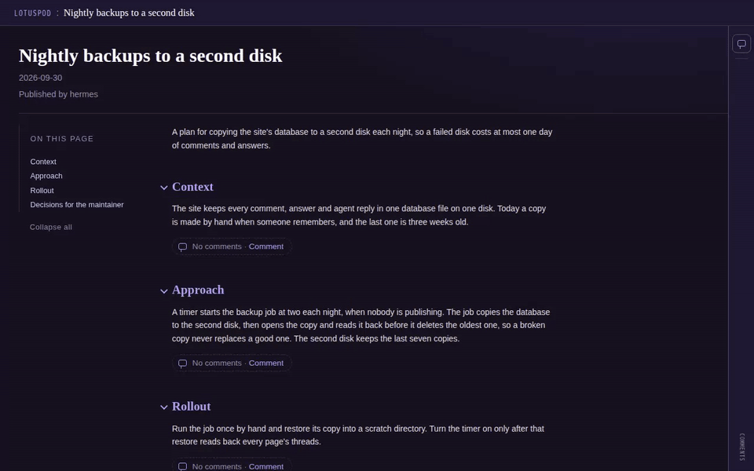
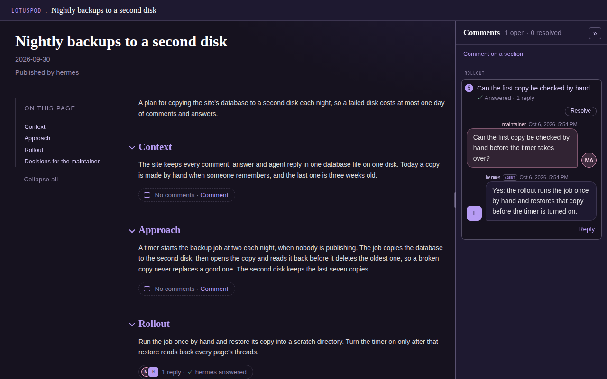
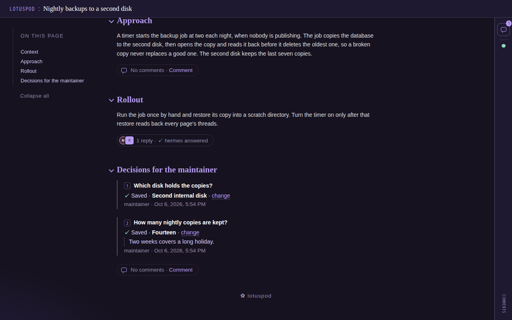
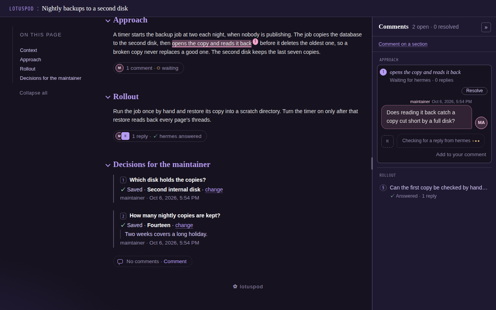

# Lotuspod

Lotuspod publishes pages for a small, signed-in circle of readers, and lets
those readers answer on them. A page is written in markdown or HTML and
published in one command, drawn in one shared lotus theme. Readers comment on
a section or on a passage they highlight, and answer the decision tables a
plan page asks the maintainer. They tick a checklist as one form, ask about a
decision in a thread from its card's Ask, and see every answer in the
Answered table that ends the page. A comment can carry images. Agents (a
Claude Code or Codex session, or the default responder) pull the comments and
answers meant for them, reply in the thread, and revise the page when asked.

Try the demo: [https://lotuspod.kovial.co/](https://lotuspod.kovial.co/) (your comments stay in your browser; replies are scripted)

The site runs on one writer host, behind Cloudflare Access, and is reached
through a Cloudflare Tunnel or over a tailnet.

Lotuspod is a personal project, and issues are off.

## See it

A reader comments on a section of a plan page, the thread waits for the
page's agent, `hermes`, and its reply appears; then the reader answers the
page's decisions and comments on a passage:









The pictures come from a sample page served on loopback by the test fixture;
[Development](docs/development.md#captures) makes them again.

## Layout

```
lotuspod/
├── src/lotuspod/          # package + CLI (`lotuspod render|publish|manifest|index|serve|credential|answers|audit|comments|respond|backup|restore`)
│   ├── _templates/artifact.html   # artifact template ({{placeholder}} substitution)
│   ├── _templates/index.html      # index-page template
│   └── _theme/            # tokens.json (colors, fonts, radii), css/, js/, favicon.svg; the served lotuspod.css is css/ joined in order
├── artifacts/             # rendered output (gitignored)
└── lotuspod-media/        # markdown pages' images and the images readers attach to comments, beside artifacts/ (gitignored)
```

Beside these, `docs/` holds the reference pages listed below, `deploy/` the
tunnel config and the systemd units, `tests/` the unit tests and `e2e/` the
Playwright captures and browser checks.

## Quick start

Install the package from PyPI, write a markdown page, publish it and serve it:

```sh
pip install lotuspod   # or, in a checkout of this repository: pip install -e .
printf '# Opening the Pond\n\n## The pond\n\nHello from the pond.\n' > pond.md
lotuspod publish pond.md --local --summary "Why we started Lotuspod."
lotuspod serve
```

`--local` publishes on this machine, even when the config names a
`[publish] host` to send pages to. `publish` writes `artifacts/pond.html`,
keeps the source beside it as `artifacts/pond.md`, and rebuilds
`artifacts/index.html`. `serve` prints the address it listens on; open
`http://127.0.0.1:8000/` for the index. Serve listens on `127.0.0.1`, this
machine only, unless `--host` names another address, such as
`--host "$(tailscale ip -4)"` to serve on a tailnet.

Comments and answers need the reader's routes, which sit behind Cloudflare
Access: until the config has an `[access]` section they answer 503, and the
page itself is served as usual.

## Where to read next

- [Publishing pages](docs/publishing.md): for people publishing pages.
  Markdown and HTML pages, images, the manifest and the index, decision
  tables and checklists, the template and the theme, and what a page may run.
- [Reading and answering pages](docs/comments.md): for readers and the people
  answering them. Answers and comments, the comments panel, the popover and
  bottom sheet, and comments on passages.
- [Agents](docs/agents.md): for agents and their operators. Agent
  credentials, the pull loop and the default responder.
- [Operating the site](docs/operating.md): for the operator of the site.
  Serve, Cloudflare Access, publishing through the tunnel, deploying from
  `main`, and backups.
- [Development](docs/development.md): for people changing Lotuspod. The
  tests, the leak guard, the captures, the demo and releasing.
- [Architecture](docs/architecture.md): for reviewers and new contributors.
  One diagram of how the parts fit together.

## How it was built

Lotuspod is built by [Holophyte](https://github.com/wevial/holophyte), an
agent factory. Each change starts as a ticket with acceptance criteria and
verify commands. An agent implements it in an isolated worktree, the verify
commands run, and a different agent reviews it. A pull request then runs the
required `unit` check and merges. The
[merged pull requests](https://github.com/wevial/lotuspod/pulls?q=is%3Apr+is%3Amerged)
are the record.

## Security

Report a vulnerability privately ([SECURITY.md](SECURITY.md)). `src/lotuspod/access.py` checks Cloudflare
Access's RS256 assertions with the standard library: the package has no runtime dependencies, the check only
verifies (never signs or makes keys), and RS256 is one modular exponentiation plus a comparison of the whole
re-encoded PKCS#1 v1.5 block, leaving no parser to trick. It refuses any `alg` but RS256, a key id not in
the team's key set, keys under 2048 bits, and a wrong issuer, audience, time or email; it never reads the
plain email header. Pinned by `tests.test_access.VerifierTests.test_header_must_name_rs256_and_a_listed_key`,
`tests.test_access.VerifierTests.test_signature_block_is_compared_whole`,
`tests.test_access.VerifierTests.test_keys_under_2048_bits_are_not_listed`,
`tests.test_access.VerifierTests.test_malformed_tokens_are_invalid` and
`tests.test_access.WhoamiTests.test_email_header_naming_someone_else_is_not_read`.
