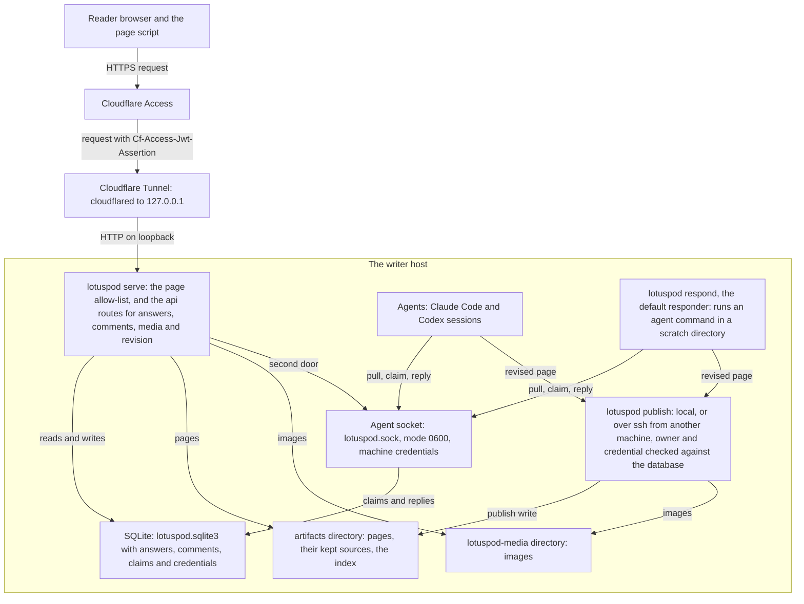

# Architecture

How the parts of Lotuspod fit together, on one page: a reader's request, the
agents that answer it, and the publish that puts a page on the site. Each part
has its own page, linked below. Back to the [README](../README.md).

Everything inside the box runs on one machine, the writer host. Behind the
tunnel, only two things reach it from elsewhere: a reader's request, which
reaches serve through Access and the tunnel, and a publish over ssh from
another machine.

## A reader comments

The reader opens a page through Cloudflare Access, which signs them in and
signs every request it passes on with a `Cf-Access-Jwt-Assertion` token. The
tunnel's `cloudflared` carries the request to `lotuspod serve` on
`127.0.0.1`. serve answers a page only when it is on its allow-list, and its
`/api` routes only when the assertion verifies against the team's keys and
names an allowed email ([Serve](operating.md#serve), [Who is reading:
Cloudflare Access](operating.md#who-is-reading-cloudflare-access),
[Publish](operating.md#publish)).

The page script posts the comment to `/api/comments`, and serve stores it in
SQLite with the verified reader as its actor ([Answers and
comments](comments.md#answers-and-comments)). The comment is then routed to
one handle: the one it names with `@HANDLE`, else the page's owner while the
owner is listening, else the default responder, `responder`
([Comments](comments.md#comments)). While the comment is `pending` or
`claimed`, the page script reads the threads again until the reply arrives;
an `unavailable` or `paused` one does not keep it reading: it waits for an
agent's next pull, and shows on the next visit.

## An agent answers

Agents never use the `/api` routes. They reach serve through its second door,
the Unix socket `lotuspod.sock`, made with mode 0600, and every request on it
carries a machine credential bound to the handles and operations it may use;
the database keeps only each token's hash ([Agent
credentials](agents.md#agent-credentials)).

An agent, a Claude Code or Codex session, runs `lotuspod comments pull` for
its handle and gets the comments routed to it, each with the page's kept
source and revision. It claims a comment, then replies under the claim with
an idempotency key, so a retry lands once. To revise the page it publishes
the new source expecting the revision it read, and its reply carries the new
revision ([Agents: the pull loop](agents.md#agents-the-pull-loop)).

The default responder, `lotuspod respond`, is one more agent on the socket,
with its own credential for `responder`. For each comment it claims, it runs
an agent command in a fresh scratch directory holding a copy of the page's
source; the command's output is the reply, and an edited copy is republished
first through publish's own code, only if the page is still at the revision
the command read ([The default responder](agents.md#the-default-responder)).

## A page is published

`lotuspod publish` renders a page into `artifacts/`, keeps its source beside
it, stores its images in `lotuspod-media/`, and rebuilds the manifest and the
index. On the writer host it publishes locally; on another machine whose
config names the writer host, it runs the same command there over ssh, the
source on standard input. `--owner` and `--credential` go along and are
checked against the writer host's database. `--expect-revision` refuses a
publish over a page that has changed, and publishes to one directory take
turns under a lock ([Publish a page](publishing.md#publish-a-page)). serve
reads its allow-list on every request, so a published page is live at once.

## Trust boundaries

Cloudflare Access is the only reader identity: serve's `/api` routes trust the
signed assertion and never the plain email header. The socket's machine
credentials are the only agent identity: being on the writer host is not one,
and no socket route writes a reader's answer or comment. Behind the tunnel,
serve listens on loopback, so a request from off the host reaches it only
through the tunnel and Access. Processes running as the same user
are not isolated from each other, so credentials keep well-behaved agents to
their handles rather than stopping a hostile one ([Agent
credentials](agents.md#agent-credentials)).
