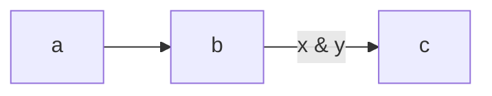

## Code

A paragraph before the fence.

```
plain fence with <tags> & ampersands
  indented line

after a blank line
```

```sh
lotuspod render --name ep --title "T"
```



A paragraph after, with `inline <code>`.
